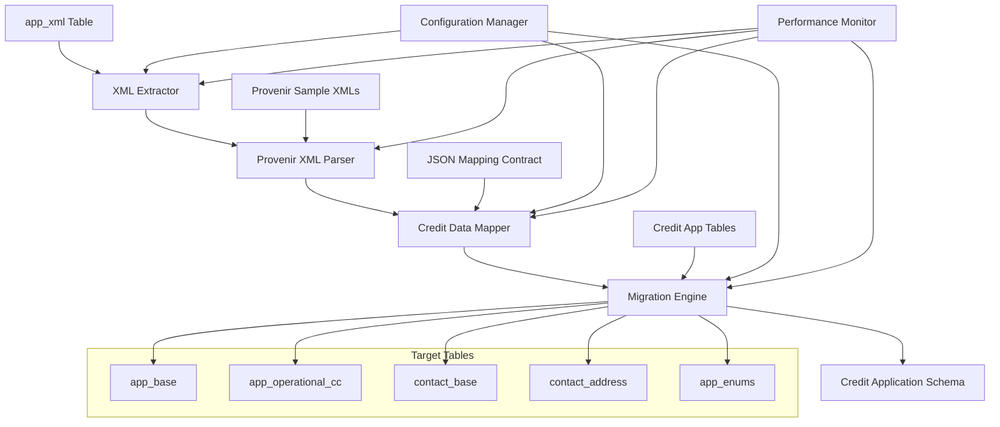

# Design Document

## Overview

The Credit Card Application XML Extraction system is designed as a high-performance, configurable data migration tool that processes Provenir credit application XML content stored in the `app_xml` table and transforms it into a normalized relational structure. The system leverages JSON mapping contracts, sample Provenir XML documents, and the credit application database schema to ensure accurate and efficient data transformation.

The architecture prioritizes performance for production-scale processing (11+ million credit application records, 50KB-5MB XML documents) while maintaining data integrity, transaction consistency, and regulatory compliance for credit application processing.

## Architecture

### High-Level Architecture



### Component Architecture

The system follows a pipeline architecture with the following key components:

1. **Configuration Manager**: Loads mapping contracts, table structures, and processing parameters
2. **XML Extractor**: Orchestrates the extraction process with batch and parallel processing
3. **XML Parser**: Handles streaming XML parsing with memory optimization
4. **Data Mapper**: Applies mapping contracts to transform XML to relational data
5. **Migration Engine**: Manages database connections and bulk insert operations
6. **Performance Monitor**: Tracks processing metrics and resource utilization

## Components and Interfaces

### Configuration Manager

**Purpose**: Centralized configuration management using existing artifacts

**Key Interfaces**:
- `loadMappingContract()`: Loads source-to-destination mapping definitions
- `loadTableStructure()`: Reads destination table schema from SQL scripts and data-model.md
- `loadSampleXML()`: Loads sample XML documents for validation and testing
- `getProcessingConfig()`: Returns batch sizes, parallel processing settings

**Input Sources**:
- Mapping contract files (source and destination mapping)
- SQL scripts defining destination table structure
- data-model.md documentation
- Sample XML documents for validation

### XML Parser

**Purpose**: High-performance streaming XML parsing optimized for large documents using Python's lxml library

**Key Interfaces**:
- `parse_xml_stream(xml_content: str) -> ElementTree`: Streaming parser using lxml for memory efficiency
- `validate_xml_structure(xml_content: str) -> bool`: Pre-processing validation with detailed error reporting
- `extract_elements(xml_node: Element) -> Dict`: Recursive element extraction with XPath support
- `extract_attributes(xml_node: Element) -> Dict`: Attribute value extraction with type awareness

**Performance Optimizations**:
- lxml.etree.iterparse() for streaming large XML documents (up to 5MB)
- C-based XML processing for maximum performance
- XPath expressions for efficient element selection
- Memory-mapped file reading for large XML content
- XML namespace handling with prefix resolution

### Data Mapper

**Purpose**: Transform parsed XML data using predefined mapping contracts with cascading ID hierarchy

**Key Interfaces**:
- `applyMappingContract(xmlData: ParsedXML)`: Apply source-to-destination mappings with element filtering
- `transformDataTypes(value: any, targetType: string)`: Type conversion logic
- `handleNestedElements(parentId: string, childElements: XMLElement[])`: Cascading ID relationship mapping
- `validateAndFilterElements(xmlRoot: Element)`: Pre-processing element validation and filtering

**XML Element Validation and Filtering**:
- **Contact Elements**: Skip if missing `con_id` OR `ac_role_tp_c` attributes
- **Address Elements**: Skip if missing `address_tp_c` attribute (graceful degradation)
- **Employment Elements**: Skip if missing `employment_tp_c` attribute (graceful degradation)
- **ID Cascading**: Extract `con_id` from parent contact element and cascade to children
- **Application Validation**: Require `app_id` and at least one valid contact for processing

**Mapping Contract Integration**:
- Reads existing mapping contract definitions
- Validates mapping completeness against sample XML
- Supports complex transformations and calculated fields
- Handles one-to-many relationships from nested XML with cascading natural keys

### Migration Engine

**Purpose**: Efficient SQL Server database operations with bulk processing using direct T-SQL

**Key Interfaces**:
- `execute_bulk_insert(records: List[Dict], table_name: str)`: SQL Server bulk insert using pyodbc fast_executemany
- `create_target_tables(sql_scripts: List[str])`: Execute CREATE TABLE T-SQL scripts directly
- `validate_target_schema() -> bool`: Schema compatibility validation using SQL Server system views
- `track_progress(processed_count: int, total_count: int)`: Progress monitoring with SQL Server performance counters

**SQL Server Optimizations**:
- pyodbc with fast_executemany=True for maximum bulk insert performance
- SQL Server Express LocalDB for development/testing
- Direct T-SQL execution avoiding ORM overhead
- SQL Server-specific bulk operations (BULK INSERT, Table-Valued Parameters)
- Connection pooling optimized for SQL Server
- Transaction management with explicit T-SQL BEGIN/COMMIT/ROLLBACK

## Data Models

### Core Data Structures

```python
from dataclasses import dataclass
from typing import List, Optional
import pyodbc

@dataclass
class MappingContract:
    source_table: str
    source_column: str
    xml_root_element: str
    mappings: List['FieldMapping']
    relationships: List['RelationshipMapping']

@dataclass
class FieldMapping:
    xml_path: str
    xml_attribute: Optional[str]
    target_table: str
    target_column: str
    data_type: str
    transformation: Optional[str] = None

@dataclass
class RelationshipMapping:
    parent_table: str
    child_table: str
    foreign_key_column: str
    xml_parent_path: str
    xml_child_path: str

@dataclass
class ProcessingConfig:
    batch_size: int
    parallel_processes: int
    memory_limit_mb: int
    progress_reporting_interval: int
    sql_server_connection_string: str
```

### Database Schema Integration

The system will work with SQL Server using direct T-SQL operations:
- Execute T-SQL CREATE TABLE scripts directly against SQL Server Express
- Read table structure using SQL Server system views (INFORMATION_SCHEMA, sys.tables)
- Use SQL Server-specific data types (NVARCHAR, BIGINT, DATETIME2, etc.)
- Leverage SQL Server constraints and indexes for data integrity
- Support for SQL Server Express LocalDB for development and testing

**Connection Management**:
- pyodbc with SQL Server ODBC Driver for optimal performance
- Connection string format: `Driver={ODBC Driver 17 for SQL Server};Server=(localdb)\\MSSQLLocalDB;Database=XMLExtraction;Trusted_Connection=yes;`
- No ORM dependencies - pure T-SQL for maximum control and performance

## Error Handling

### Error Categories and Responses

1. **XML Parsing Errors**:
   - Invalid XML structure: Log error, skip record, continue processing
   - Missing required elements: Apply default values or null handling per mapping contract
   - Namespace issues: Use namespace resolution from sample XML analysis

2. **Data Mapping Errors**:
   - Type conversion failures: Log error with source data, apply fallback conversion
   - Missing mapping definitions: Use configurable default behavior (skip or error)
   - Constraint violations: Log detailed error, optionally halt processing

3. **Database Errors**:
   - Connection failures: Implement retry logic with exponential backoff
   - Constraint violations: Log affected records, continue with remaining batch
   - Transaction failures: Rollback batch, retry with smaller batch size

4. **Performance Issues**:
   - Memory pressure: Reduce batch size automatically, trigger garbage collection
   - Slow processing: Adjust parallel thread count, report performance metrics
   - Timeout issues: Implement configurable timeouts with graceful degradation

### Error Recovery Strategies

- **Checkpoint System**: Save progress at configurable intervals for restart capability
- **Dead Letter Queue**: Store problematic records for manual review and reprocessing
- **Graceful Degradation**: Automatically adjust performance parameters when issues detected
- **Detailed Logging**: Comprehensive error logs with source record identifiers for troubleshooting

## Testing Strategy

### Unit Testing Focus

- XML parsing accuracy using sample XML documents
- Data mapping correctness against mapping contracts
- Type conversion and validation logic
- Error handling and recovery mechanisms

### Integration Testing

- End-to-end processing with sample data subsets
- Database schema creation and validation
- Performance testing with varying XML document sizes
- Parallel processing coordination and thread safety

### Performance Testing

- Throughput testing: Validate 1000+ records/minute target
- Memory usage testing: Ensure stable processing of 5MB XML documents
- Scalability testing: Verify performance with increasing parallel threads
- Stress testing: Process large batches to identify bottlenecks

### Validation Testing

- Mapping contract compliance: Verify all mappings are applied correctly
- Data integrity: Compare source XML content with extracted relational data
- Schema compatibility: Validate generated tables match intended structure
- Sample XML coverage: Ensure all XML patterns in samples are handled correctly

The testing strategy leverages the existing sample XML documents and mapping contracts to ensure comprehensive validation of the extraction and transformation logic.